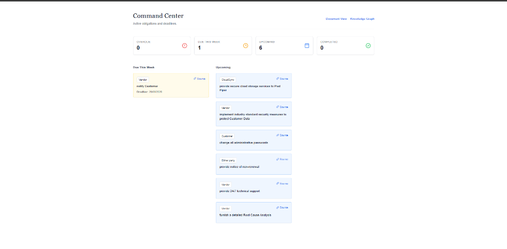
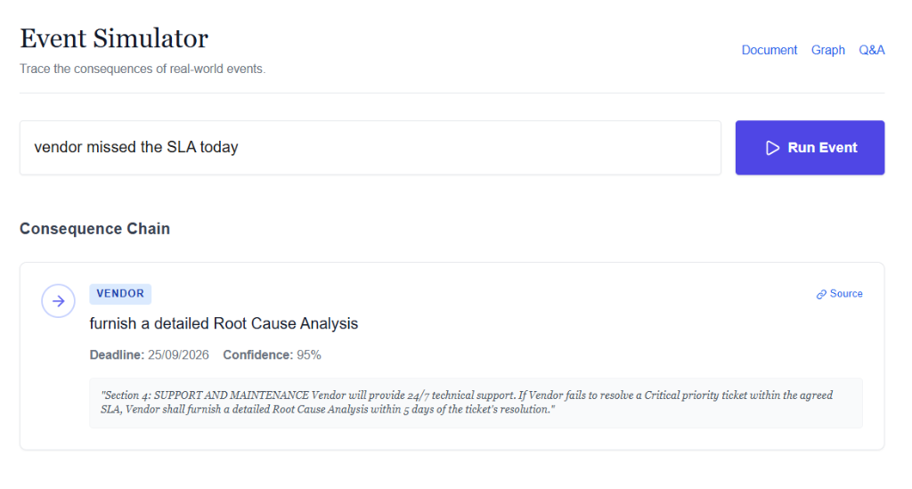

# TERM // The Executable Contract Graph

"Between the words and what follows."

Contracts are the operating system of business, yet enterprise software treats them like dead text. We index them, search them, and file them. TERM abandons semantic search for deterministic execution. It compiles ambiguous legal language into a directed acyclic graph (DAG), treating obligations, triggers, and consequences as a state machine.

## The Problem

A vendor breaches a critical SLA. In standard environments, discovering the consequence requires manual parsing: a lawyer reads Section 4, traces a cross-reference to Section 9 for liabilities, checks Section 11 for notice periods, and manually projects a 30-day window. By the time the claim is drafted, the service credit window has closed.

TERM collapses this latency to zero. Type "vendor missed the SLA." The engine traverses the graph, computes the temporal logic, and outputs the exact consequence chain with strict citations.

## Core Architecture

### 1. Knowledge Graph
Extracts explicit obligations, parties, and events, compiling them into a NetworkX directed graph. Enforces logical structure through `depends_on` and `conflicts_with` edges.

### 2. Event Simulator
Translates natural language events into graph traversals. Computes real-world deadlines against implicit contract rules, cascading through the DAG to find ultimate escalation rights.

### 3. Contract Time Machine
Semantically diffs sequential contract versions. Filters cosmetic wording from material edits, then traces forward to list every downstream obligation broken by the change.

### 4. Risk Radar
A categorical risk evaluation matrix. Refuses arbitrary scoring in favor of concrete, cited next-actions tied to specific clauses.

<br/>

<br/>

<br/>

## The Engineering Reality

Wrapping a PDF in a chatbot is trivial. Making a contract executable requires solving hard, deterministic problems:
- **Implicit Temporal Logic**: Resolving abstract legal timeframes ("48 hours", "30 days prior to expiration") against dynamic, real-world trigger dates.
- **BFS Consequence Tracing**: Traversing backwards from an event to an obligation, then cascading across dependency edges to hit escalation rights without falling into infinite loops.
- **Anti-Hallucination Validation**: An enforcement layer that strictly separates answers from reasoning, mathematically verifying that every cited section exists in the retrieved context before returning a payload.

## Competitive Landscape

| Paradigm | Legacy CLM (e.g., Ironclad) | LLM Wrappers (e.g., Harvey) | TERM |
| :--- | :--- | :--- | :--- |
| **Core Model** | Static filing cabinet | Black-box semantic search | Auditable state machine |
| **Logic Tracing** | None | Hallucinated summaries | Deterministic graph traversal |
| **Verification** | Manual reading | Unauditable | Strict citation validation |

## Pipeline

```text
[PDF Upload]
     |
     v
(PyMuPDF Parser) -> Text & Section Headers
     |
     v
(Groq / gpt-oss-20b) -> Structured JSON Extraction
     |
     v
[Supabase DB] -> Clauses & Obligations
     |
     v
(NetworkX) -> DAG Construction & Edge Linking
     |
     v
[BFS Tracer] -> Event Simulation & Temporal Math
```

## Tech Stack

| Technology | Purpose | Rationale |
| :--- | :--- | :--- |
| FastAPI | Backend API | Native async execution and built-in OpenAPI schema generation. |
| Next.js | Frontend UI | Zero-config deployment with App Router architecture. |
| Supabase | Database | Out-of-the-box Postgres with instant REST availability. |
| NetworkX | Graph Engine | Python-native DAG traversal, bypassing the overhead of Neo4j. |
| Sentence-Transformers | RAG Embeddings | In-memory `all-MiniLM-L6-v2` eliminates external vector DB latency. |
| Groq | Inference | Near-instant JSON-mode generation for structural extraction. |

## Local Execution

1. Clone the repository and navigate to the `api` directory.
2. Initialize a virtual environment: `python -m venv venv` and `.\venv\Scripts\activate`.
3. Install dependencies: `pip install -r requirements.txt`.
4. Provision a `.env` file in `api/` containing `SUPABASE_URL`, `SUPABASE_KEY`, and `GROQ_API_KEY`.
5. Boot the backend: `uvicorn main:app --reload`.
6. Open a new terminal, navigate to the `web` directory.
7. Install dependencies: `npm install`.
8. Provision a `.env.local` file in `web/` containing `NEXT_PUBLIC_API_URL=http://127.0.0.1:8000`.
9. Boot the frontend: `npm run dev`.

## Synthetic Test Environment

The repository includes `saas_subscription.pdf` and two additional mock contracts within the `test-contracts/` directory. Real contracts carry confidentiality risks and highly inconsistent formatting. These synthetic documents provide a deterministic baseline to validate the graph traversal logic under controlled conditions.

## System Constraints

1. Graph generation relies heavily on the structural integrity of the source PDF. Scanned documents or non-standard formatting degrade the PyMuPDF section splitter, yielding malformed nodes.
2. The dependency linking pass restricts cross-reference checks to clauses sharing explicit entities to conserve token limits and latency. Nuanced legal interplay lacking explicit markers is currently bypassed.
3. The BFS consequence tracer is heuristically capped at a depth of 6 to prevent infinite loops caused by circular contract drafting.

## Strategic Roadmap

1. **Cross-Document Graphing**: Expanding the architecture to map edges across independent documents (e.g., linking a Master Services Agreement to a specific Statement of Work).
2. **Ticketing Integration**: Connecting the consequence tracer to Jira/Linear via webhooks to auto-generate legal review tickets on the exact date an obligation triggers.
3. **Pre-Signature Redlining**: Shifting the Version Diff engine left, allowing users to simulate the downstream impact of a counterparty's edit before executing the agreement.
4. **Live API Monitoring**: Hooking the natural language event router to actual performance logs, automatically triggering the graph if SLA metrics drop below established thresholds.

## License

MIT License
