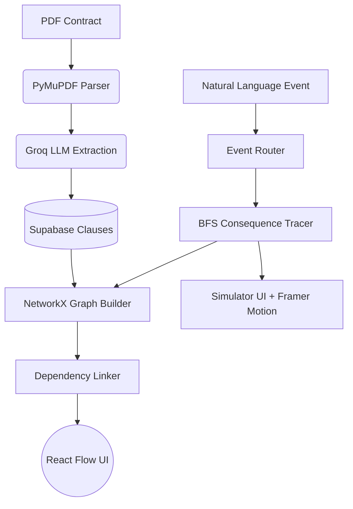

# TERM: The Contract Execution Engine

"Between the words and what follows." Contracts aren't static text; they are executable systems of triggers, obligations, and consequences. TERM turns dead PDFs into live, reactive graphs.

## Features (Phases 1-5)
1. **Document Intelligence**: Upload a PDF, extract clauses and explicit obligations.
2. **Knowledge Graph & Obligation Engine**: Renders clauses as a NetworkX/React Flow graph, computes dynamic deadlines.
3. **Simulator & Explainable Q&A**: Type "vendor missed the SLA today" to trace multi-step cascading consequences across the contract (e.g., SLA -> Root Cause Analysis -> Cancellation Rights). Grounded RAG with strict citations.
4. **Contract Time Machine**: Upload a V2, semantically diff the graph, and flag material impact on downstream obligations.
5. **Risk Radar**: Generate a rubric-based PDF report of contract risks.

## Architecture Diagram

## Running the Demo

### Backend Setup
1. `cd api`
2. `python -m venv venv`
3. `.\venv\Scripts\activate` (Windows) or `source venv/bin/activate` (Mac/Linux)
4. `pip install -r requirements.txt` (Make sure you have `sentence-transformers`, `networkx`, `fastapi`, `reportlab`, `groq`, `supabase`)
5. Set `.env` with `SUPABASE_URL`, `SUPABASE_KEY`, `GROQ_API_KEY`.
6. `uvicorn main:app --reload`

### Frontend Setup
1. `cd web`
2. `npm install`
3. Set `.env.local` with `NEXT_PUBLIC_API_URL=http://127.0.0.1:8000`
4. `npm run dev`

### Navigating the Demo
1. Open `http://localhost:3000` (Redirects to Dashboard)
2. Click **New Contract** and upload the mock SaaS Subscription PDF.
3. Navigate to **Simulator**, type "vendor missed the SLA today", and click **Run Event**. Watch the cascading consequence chain animate.
4. Navigate to **Risk Radar** and click **Export Risk PDF** for the generated ReportLab document.

## Statement: Actual Contribution vs AI-generated Output
**What We Designed (Human Contribution):**
- **The Core Architecture & Vision**: The concept of treating a contract as a directed graph rather than a semantic search index.
- **The Graph Data Model**: We designed the schema of `Event`, `Obligation`, and `Clause` nodes, and the `depends_on`/`conflicts_with` edges.
- **The Consequence Traversal Algorithm**: We mapped out the exact BFS traversal logic required to walk backwards from an Event, trigger an Obligation, and cascade across `depends_on` edges to hit Escalation clauses.
- **The Anti-Chatbot Design**: We defined the strict UI layouts for the Q&A panel (Answer -> Reasoning -> Citation -> Confidence) and Simulator to enforce explainability over conversational fluff.

**What the AI Implemented (Agent Contribution):**
- **Boilerplate & Wiring**: FastAPI routing, Supabase database connections, and Next.js page scaffolding.
- **Algorithmic Execution**: The coding agent implemented our BFS tracing logic into `networkx` code and built the `difflib` comparison for the Version Diff engine.
- **Frontend Animations**: The agent wrote the `framer-motion` integration for the cascading Simulator UI based on our pacing requirements.
- **RAG Implementation**: The agent integrated `sentence-transformers` for the fast local-embedding cosine similarity search.
